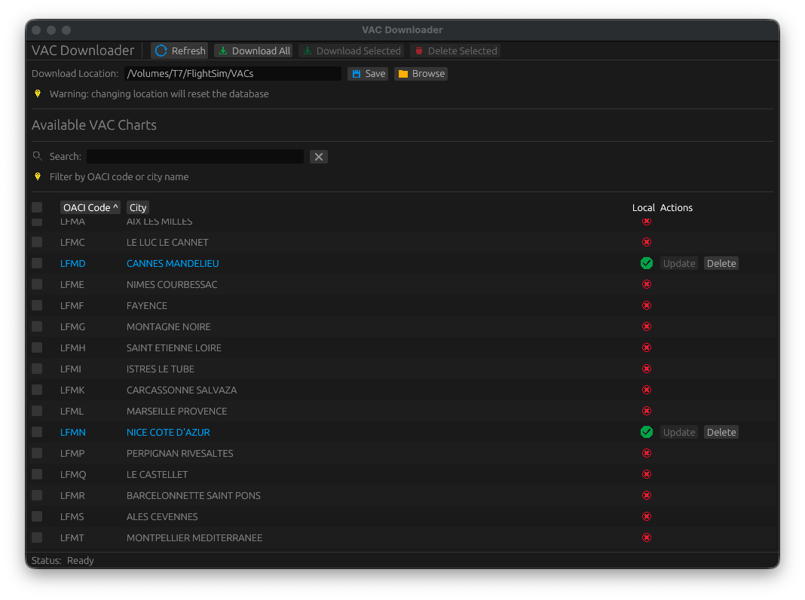

# VAC Downloader GUI

A simple desktop application to download and manage Visual Approach Charts (VAC) from the French SIA SOFIA database.



## Features

- 📋 **Browse all VAC charts**: View 505+ available charts with airport codes and city names
- ⬇️ **Easy downloads**: Download all charts at once or select specific ones
- 📂 **Open PDFs directly**: Click on any airport code or city name to open the chart
- 🔄 **Stay up to date**: Check for updates and download newer versions
- 🔍 **Quick search**: Filter charts by airport code or city name
- 🗑️ **Manage storage**: Delete charts you no longer need
- ✓ **Visual status**: See at a glance which charts are downloaded and which need updates

## Installation

### Download

Download the latest version for your operating system from the [Releases](../../releases) page:

- **macOS**: Download the `.dmg` or `.app` file
- **Windows**: Download the `.msi` or `.exe` installer
- **Linux**: Download the `.AppImage` or `.deb` package

### Platform-Specific Setup

#### macOS

Since the application is not yet signed with an Apple Developer certificate, macOS will block it by default. To run the application:

1. **Download and install** the application
2. **Remove the quarantine flag** by opening Terminal and running:
   ```bash
   xattr -cr /Applications/Vac\ Downloader\ GUI.app
   ```
   (Adjust the path if you installed it elsewhere)
3. **Launch the application** normally

Alternatively, you can:
1. Right-click (or Control-click) on the application
2. Select "Open" from the menu
3. Click "Open" in the security dialog

#### Windows

The application requires the Visual C++ Runtime. If you encounter an error about missing `vcruntime140.dll`:

1. **Download and install** the Microsoft Visual C++ Redistributable from:
   [https://www.microsoft.com/fr-fr/download/details.aspx?id=48145](https://www.microsoft.com/fr-fr/download/details.aspx?id=48145)
2. **Restart your computer**
3. **Launch the application**

#### Linux

For `.AppImage` files:
1. Make the file executable: `chmod +x Vac-Downloader-GUI-*.AppImage`
2. Run it: `./Vac-Downloader-GUI-*.AppImage`

For `.deb` packages:
```bash
sudo dpkg -i vac-downloader-gui_*.deb
sudo apt-get install -f  # Install dependencies if needed
```

## Usage

### First Launch

When you first open the application, it will:
1. Automatically create a configuration file
2. Fetch the list of available VAC charts from the SIA SOFIA API
3. Display all 505+ charts in the main window

### Downloading Charts

**To download all charts:**
1. Click the "Download All" button at the top
2. Wait for the download to complete (progress shown in status bar)

**To download specific charts:**
1. Use the search box to filter charts (by airport code or city)
2. Check the boxes next to the charts you want
3. Click "Download Selected"

### Opening Charts

Simply click on any **airport code** (OACI) or **city name** in the list to open the PDF in your default viewer.

### Updating Charts

Charts are regularly updated by the SIA. The application shows a yellow indicator (⚠) when a newer version is available:

1. Look for charts with the yellow "needs update" icon
2. Click the "Update" button next to the chart
3. The latest version will be downloaded

### Managing Storage

To delete a chart you no longer need:
1. Find the chart in the list (it will have a green ✓ in the "Local" column)
2. Click the "Delete" button
3. Confirm the deletion

### Refreshing the List

Click the "Refresh" button to:
- Fetch the latest list of available charts from the API
- Update the status of your local charts
- Check for newer versions

## Configuration

The application stores its data in standard system locations:

- **macOS**: `~/Library/Application Support/vac-downloader-gui/`
- **Linux**: `~/.config/vac-downloader-gui/`
- **Windows**: `%APPDATA%\vac-downloader-gui\`

You can customize the download location by editing the `config.toml` file in this directory:

```toml
database_path = "vac_cache.db"
download_directory = "downloads"
```

Change `download_directory` to any path where you want to store the PDF files.

## Troubleshooting

### macOS: "App is damaged and can't be opened"

This is due to macOS Gatekeeper. Follow the instructions in the [macOS setup section](#macos) above to remove the quarantine flag.

### Windows: "vcruntime140.dll is missing"

Install the Visual C++ Redistributable as described in the [Windows setup section](#windows) above.

### Linux: "Permission denied"

Make sure the AppImage file is executable:
```bash
chmod +x Vac-Downloader-GUI-*.AppImage
```

### Charts won't download

- Check your internet connection
- Verify that the SIA SOFIA API is accessible
- Try clicking "Refresh" to reload the chart list

## Support

If you encounter any issues or have questions:
- Open an issue on the [GitHub repository](../../issues)
- Check existing issues for solutions

## License

This project is open source. See the LICENSE file for details.
